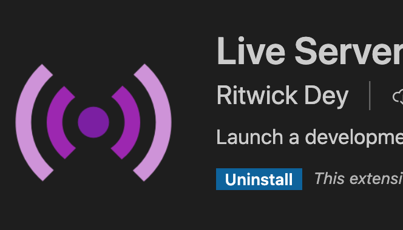

# Import & export en JS Introduction

Nous allons vous montrer dans deux contextes différents comment faire des import/export en ES6.

Vous avez deux exemples dans le dossier Examples de ce chaptire :

- Examples/InNodeJS

- Examples/HTML

1. Examples/InNodeJS

Structure des dossiers et fichiers :

```text
InNodeJS/
    core/
        parse.js
    app.js
    config.js
    package.json
```

Dans le contexte "NodeJS", c'est-à-dire lorsqu'on exécute nos fichiers en ligne de commande comme vu dans le cours, et pour les versions de NodeJS 14 et 12, nous devons créer un fichier **package.json** dans lequel on précise à NodeJS que l'on utilise la syntaxe ES6 pour les import et export (sinon ça ne marchera pas ...).

- Fichier package.json, regardez dans le dossier

```json
{ "type": "module" }
```

Testez le code pour voir si tout marche correctement, dans le dossier InNodeJS :

```bash
node app.js

// dans la console
API : ABC123
PASS : 123
Phrase parsing  891819 891819
```

## export par défaut

Vous ne pouvez faire qu'un export, de constante, fonction ou classe par défaut par fichier.

Dans le fichier core/parse.js nous exportons la fonction parse que nous utilisons dans le fichier app.js

## export multiples

Vous pouvez faire autant d'export de constante, fonction, classe que vous souhaitez :

```js
export const API = "ABC123";
export const PASS = "123";

export const sayHello = message => `Voici mon message ${messaqge}`;
```

Vous pouvez également exporter des constantes, classes, fonctions en utilisant la syntaxe suivante :

```js
const API = "ABC123";
const PASS = "123";

const sayHello = message => `Voici mon message ${messaqge}`;

export { API, PASS, sayHello };
```

## import 

Les exemples d'import sont fait dans le fichier app.js.

Pour importer une constante, fonction ou classe qui a été exporté par défaut, vous pouvez dans ce cas renommer cet import, ci-dessous on a renommé la fonction parse exportée par défaut depuis le fichier core/parse.js :

```js
import parseDigit from './core/parse.js';

// appel de la fonction exportée
parseDigit('ma phrase9909: hhh:  9897');
```

Si on importe des constantes, classes ou fonctions (export multiple) alors on utilisera la synstaxe suivante pour les importer :

```js
import { API, PASS } from './config';
```

## Dans le contexte du navigateur Web (import/export)

Récupérez l'exemple dans le dossier HTML dans le dossier Examples.

Vous devez également installer un module pour vscode, il nous permettra de lancer un live server :



Allez dans la partie installation de module et installez le module Live Server de Ritwick Dey.

Une fois installé, vous devrier voir, placez dans la barre d'état en bas à droite de vscode, un bouton "Go Live". Cliquez dessus, le live serveur lancera votre navigateur par défaut, et naviguez dans vos dossiers pour afficher la page index.html.

*Remarque : le live server se lance à la racine de votre projet vscode.*

Dans cette page nous n'avons qu'à charger le fichier app.js en mentionnant à notre navigateur que le fichier importé utilise des modules, voyez l'attribut type="module" dans la balise script ci-dessous, ce code ce trouve dans la page index.html : 

```html
 <script type="module" src="./app.js"></script>
 ```
 Le code devrait fonctionner correctement. Pour le vérifier inspectez (console) la page Web, vous devriez voir :

```text
API : ABC123  app.js:12 
PASS : 123    app.js:15 
```

Remarque : ne cherchez pas à afficher la page index.html directement depuis vos dossiers et fichier avec votre explorateur de fichiers/dossiers de votre système, passer par le Live Server de vscode. Le navigateur bloquera les imports (point de sécurité du navigateur, nous en reparlerons).

Pour arrêter le live server dans vscode : cliquez en bas à droite sur l'onglet suivant :
**Port: 5500**

Remarque : le port peut éventuellement être différent.

